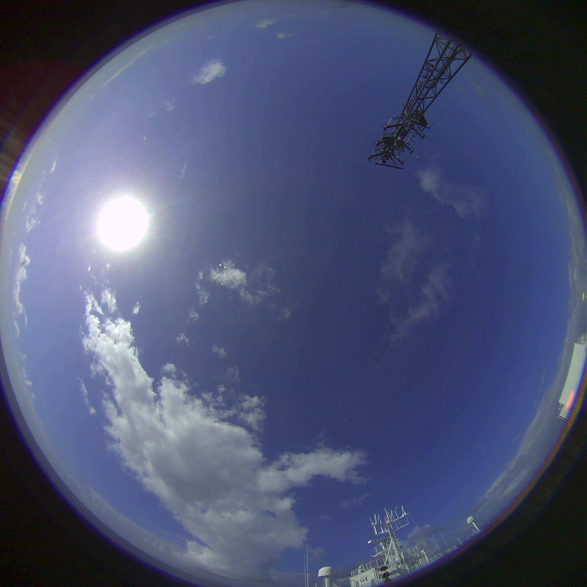
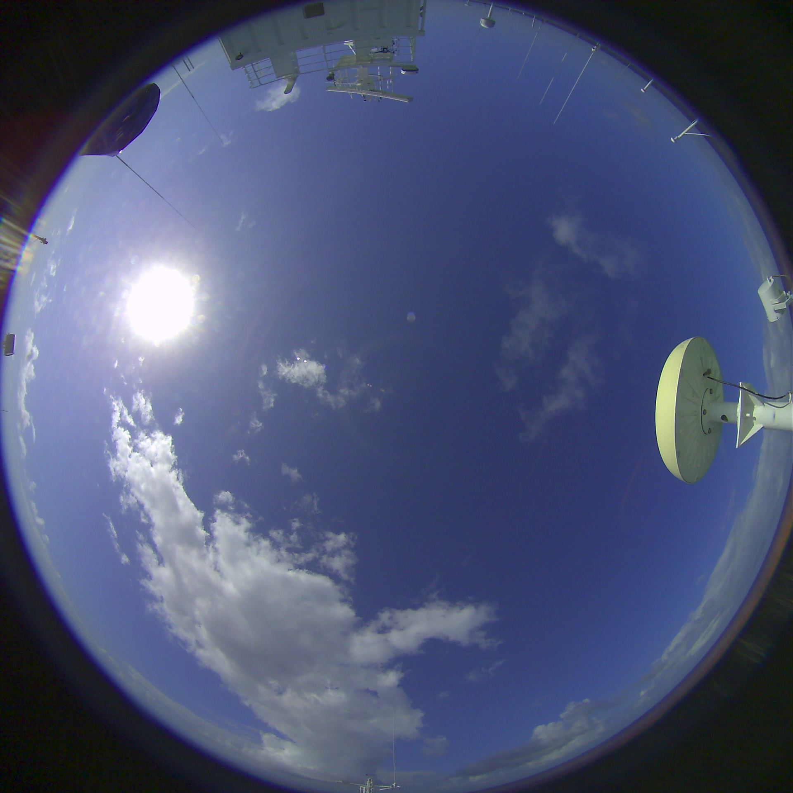

### Оценка балла общей облачности (БОО, total cloud cover, TCC)

<p style="text-align: justify">В этом соревновании вам предстоит обучить нейросетевую модель для оценки балла общей облачности по широкоугольным оптическим снимкам видимой полусферы небосвода.</p>

<p style="text-align: justify">Приходящая солнечная радиация - единственный (условно) стабильный и (условно) восполняемый источник энергии на планете Земля. Кроме того, солнечная радиация - практически единственный источник энергии, питающий всю динамику атмосферы и океана. Радиационный блок в моделях атмосферы - важнейшая часть. Для оценки приходящей солнечной радиации в моделировании геофизических систем в настоящий момент чаще всего применяются т.н.. параметризации - упрощенные схемы, аппроксимирующие процессы рассеяния, поглощения, переотражения, переизлучения солнечной радиации в атмосфере. Важнейшей переменной во всех параметризациях приходящей солнечной радиации является балл общей облачности (БОО).</p>

<p style="text-align: justify">
Для построения аккуратной параметризации потоков приходящей на поверхность коротковолновой и длинноволновой радиации нужны долговременные ряды соответствующих показаний радиометрических приборов и оценки балла общей облачности.
</p>

<p style="text-align: justify">
В Лаборатории взаимодействия океана и атмосферы ИОРАН ведется работа по автоматизации наблюдений за облачностью. Для этого была разработана и апробирована установка, проводящая оптическую съемку облачности с поверхности. Результатом съемки являются снимки следующего рода:
</p>

<table>
    <tr>
        <td width="50%">
            
        </td>
        <td width="50%">
            
        </td>
    </tr>
</table>

Рис. 1. Снимки видимой полусферы небосвода над океаном, сделанные двумя разнесенными на расстояние L камерами.

Одновременно со съемкой ведутся визуальные наблюдения. В частности, в результате таких наблюдений фиксируется балл общей облачности, оцененный наблюдателем.

В соревновании предлагается написать и обучить нейросеть, способную аппроксимировать балл общей облачности по данным снимка.

Балл общей облачности - дискретная величина, нижнее значение - 0, максимальное значение - 8. Другие значения в качестве ответов алгоритма не принимаются. Промежуточные значения, оцениваемые вашей нейросетью, могут быть любыми: вы можете решать задачу как регрессию, как классификацию, как "упорядоченную классификацию" (ordinal regression). Главное - чтобы на выходе алгоритма были целые значения от 0 до 8.

<p>&nbsp;</p>

В качестве доступных данных вам предоставляются сами снимки, а результаты экспертной оценки, а также некоторые дополнительные данные.

По [ссылке](https://www.dropbox.com/s/nes12l1x7pehv46/train.tar.gz) можно скачать полный архив с исходными данными, доступными на этапе вашего исследования.

Структура файлов в этом архиве следующая:

```
./
├── ABP42
│   ├── masks
│   └── snapshots
│       ├── snapshots-2017-01-22
...
│       ├── snapshots-2017-03-19
│       └── snapshots-2017-03-20
├── AI49
│   ├── masks
│   └── snapshots
│       └── ai49-snapshots-2015-07-01
├── AI52
│   ├── masks
│   └── snapshots
│       ├── snapshots-2016-10-05
...
│       ├── snapshots-2016-10-30
│       └── snapshots-2016-10-31
├── AMK79
│   ├── masks
│   └── snapshots
│       ├── snapshots-2019-12-10
...
│       ├── snapshots-2020-01-03
│       └── snapshots-2020-01-05
└── ANS31
    ├── masks
    └── snapshots
        ├── snapshots-2015-12-16
...
        ├── snapshots-2016-01-13
        └── snapshots-2016-01-14
└── index.pkl
```

В каждой директории типа `snapshots-xxxx-xx-xx` находятся файлы `*.jpg` с именами типа `img-2017-01-22T00-05-44devID1.jpg`, где указаны последовательно (`img-XXXX-XX-XXTXX-XX-XXdevIDY.jpg`)
- `XXXX-XX-XXTXX-XX-XX` - дата и время в формате год-месяц-день(T)час-минута-секунда (по UTC)
- `Y` - номер камеры из двух (1 или 2).

В файле `index.pkl` записаны данные экспертной оценки и некоторые дополнительные сведения о снимках. Данные из этого файла можно считать следующим образом:

```
import pickle
with open('./index.pkl', 'rb') as f:
    data_index = pickle.load(f)
```

В переменной `data_index` в результате такого действия окажется список словарей, каждый из которых описывает один снимок. Состав данных во всех словарях один и тот же. Пример одного такого словаря приведен ниже:

```
{'jpg_filename': 'img-2019-12-11T10-02-37devID2.jpg',
 'lon': -10.783049166666666,
 'lat': 41.343314666666664,
 'mask_fname': 'AMK79/masks/mask-id2.png',
 'mission': 'AMK79',
 'devID': 2,
 'observations_dt': datetime.datetime(2019, 12, 11, 10, 0),
 'observed_TCC': 4}
```

Здесь:
- `jpg_filename` - имя файла изображения
- `lon`, `lat` - географические координаты точки съемки
- `mask_fname` - имя файла маски
- `mission` - краткое наименование экспедиции, в которой была произведена съемка
- `devID` - номер камеры, с которой был получен снимок
- `observations_dt` - дата и время момента наблюдений
- `observed_TCC` - балл общей облачности (целевая переменная)

Исследуя данные, можно будет заметить, что в качестве тренировочной выборки предоставлены снимки, полученные только в экваториальной области, тропиках и субтропиках (фильтр по широте от 45°S до 45°N). При этом качество моделей будет оцениваться на данных, полученных в Северной Атлантике (фильтр по широте - свыше 45°N).

Также следует понимать, что выборка не сбалансирована по классам. Проверка качества на отложенных данных будет проводиться на сбалансированных подвыборках, с оценкой неопределенности бутстрепом, по следующим мерам качества:
- Accuracy (`Acc`) (доля верных ответов)
- Доля ответов, верных с ошибкой до 1 балла (`C1`). Например, для показаний эксперта, равных 4 баллам, верными будут считать ответы алгоритма от 3 до 5 баллов включительно.

Современные методы оценки БОО, применяющиеся в большинстве случаев, основаны на эмпирических индексах (рассчитываемых поточечно), в которых БОО оценивается по количеству точек изображения, превышающих определенное пороговое значение. Современные исследования показывают, что максимально достижимые значения метрик качества, приведенных выше, в таких методах составляют от 27% до 29.5% для `Acc` и от 61.5% до 62% до `C1`.

Исследование свойств сверточных нейронных сетей в предлагаемой задаче показывает, что за счет шумности данных и шумности разметки нейросетью сложно достичь качества, надежно превышающего 45% в мере `Acc` и 85% в мере `C1`.

В случае значимого прорыва в этих исследованиях участнику будет предложено поучаствовать в готовящейся публикации результатов в высокорейтинговом журнале.


